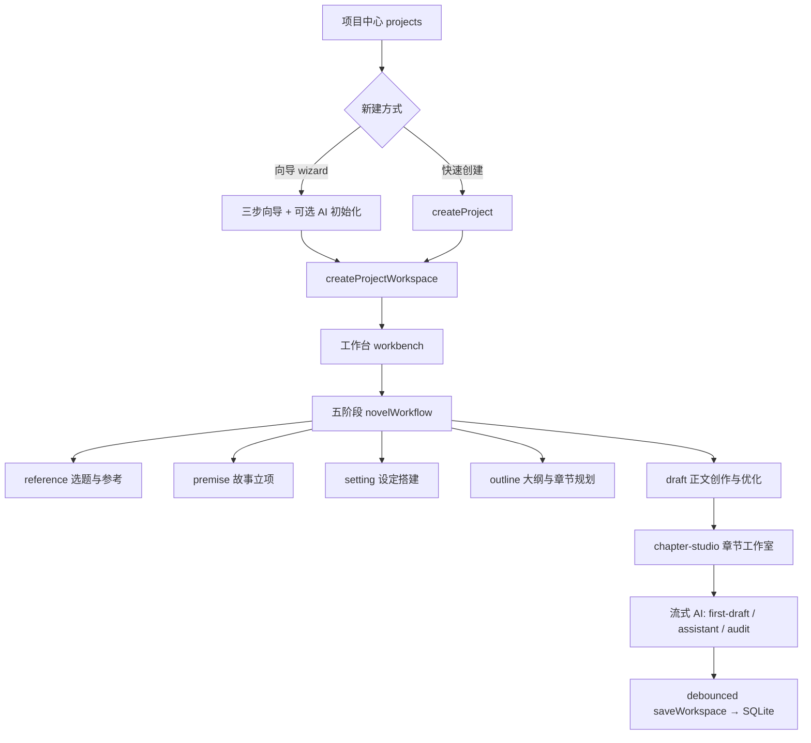

## 问题与范围

用户问：当前代码设计上，创作一部小说的流程是什么？

探索范围：`renderer` 视图路由、新建向导、`novelWorkflow` 五阶段、工作台面板、`chapter-studio` AI 任务、主进程 `orchestrator` 与 `workspace-store` SQLite 表。

## 速答

CharacterArc 把「写一本小说」建模为四层：**视图切换** → **工作台模块化面板** → **AI 任务管道** → **SQLite 持久化**。

**创建三条路径**：空白项目 / `project-bootstrap` 快速生成 / `spiralBootstrap` 三轮深度生成（seed → expand → validate）。

**正文阶段核心 AI 任务**：`chapter-first-draft`（流式初稿 + 后处理 light-check / state-delta / 知识索引）、`chapter-assistant`（润色续写）、`chapter-audit` / `chapter-repair`。

数据全部落在 `<userData>/data/workspace.db`，`userData` 规范路径为 `%APPDATA%\CharacterArc`（旧 `characterarc` 会在首次启动时迁移）。

## 关键证据

| # | 证据 | 支撑结论 |
|---|---|---|
| 1 | `renderer/src/stores/app.ts:173` — `currentView` 含 `projects \| wizard \| workbench \| chapter-studio` | 创作流程由视图状态机驱动 |
| 2 | `renderer/src/pages/ProjectWizardPage.vue:189-238` — 三种 `generationMode` 分别走 spiral / `project-bootstrap` / 空白 seed | 立项有三种 AI 初始化策略 |
| 3 | `renderer/src/stores/app.ts:961-1010` — `createProjectWorkspace` 写 Pinia 后切 `workbench` 并 `schedulePersist` | 项目创建后立即进入工作台并持久化 |
| 4 | `renderer/src/features/novelWorkflow/stages.ts:21-82` — 五阶段定义及 `targetPanel` 映射 | 方法论层工作流与 UI 面板绑定 |
| 5 | `renderer/src/pages/WorkbenchPage.vue:75-86` — 侧边栏面板列表（概览/角色/关系/世界观/大纲/章节/灵感/知识库/全局助手） | 工作台模块化创作入口 |
| 6 | `renderer/src/stores/app.ts:864-873` — `openChapterStudio` 切 `chapter-studio` 视图 | 正文创作有独立沉浸式视图 |
| 7 | `electron/main/ai/runtime/orchestrator.ts:39-61,204-220` — agent 白名单与流式任务分支 | AI 分 agent-loop 与单次/流式两路 |
| 8 | `electron/main/index.ts:27-39` — `userData` 固定为 `CharacterArc`，旧路径迁移 | SQLite 落盘位置可确定 |

## 细节展开

### 五阶段与创作记忆文档

`workflowStageDocumentMap`（`renderer/src/features/novelWorkflow/documents.ts:74-80`）把 8 类 `workflow_documents`（创作计划、灵感、进度、概况、世界设定、人物关系、伏笔、素材）按阶段分组，在 `NovelWorkflowPanel` 中按分卷维护。

### 项目数据模型（SQLite）

`electron/main/workspace-store.ts:57-73` 起：`projects` 表存元信息；关联 `worldview_entries`、`characters`、`outline_volumes`、`outline_items`、`chapters`、`chapter_versions`、`workflow_documents`、`plot_threads`、`knowledge_documents` 等，均带 `project_id` 外键。

### 渲染进程数据流

`renderer/src/features/workspace/persistence.ts` — Pinia 变更 → 防抖 → IPC `saveWorkspace` → 主进程写 SQLite；渲染进程不直接碰文件系统或 AI 提供商。

## 未决问题

- `novelWorkflow` 五阶段状态（`todo/doing/done`）目前主要是 UI 引导，是否强制约束面板操作顺序需进一步确认。
- `AGENT_TASK_WHITELIST` 注释提到后续会扩到 `chapter-first-draft`，当前白名单尚未包含（`electron/main/ai/settings.ts:203-208`）。

## 后续建议

若要把「子系统模块索引」补进架构总入口，可基于本 explore 走 `cs-arch` 的 `backfill` 模式更新 `.codestable/architecture/ARCHITECTURE.md` §3。

## 相关文档

- `.codestable/architecture/ARCHITECTURE.md`（骨架，待填充）
- 仓库 `CLAUDE.md` — 开发者向架构速查（非 CodeStable 产物）
