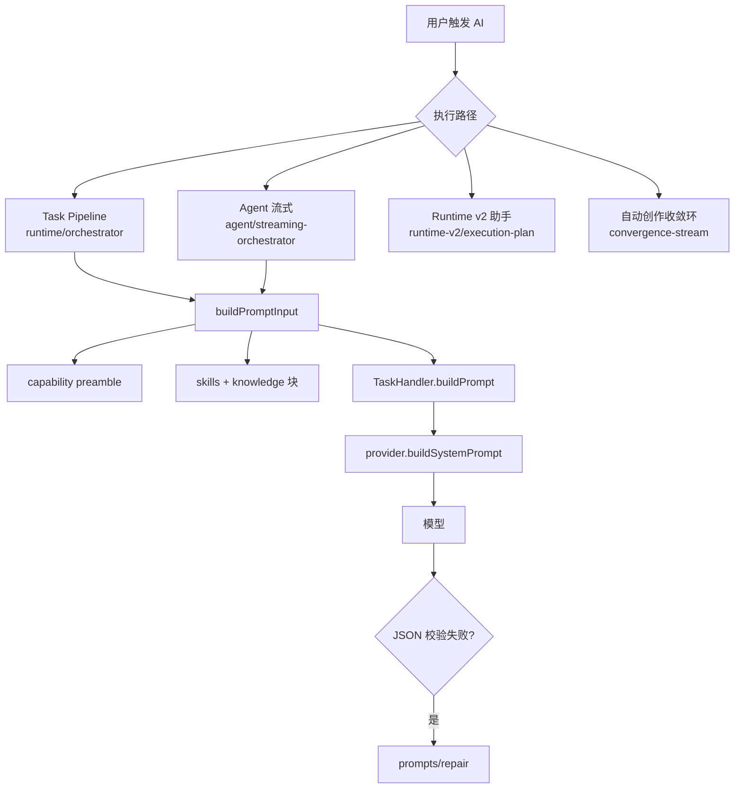

## 问题与范围

**问题**：CharacterArc 的提示词工程是怎么设计的？prompt 在哪里定义、如何组装、有哪些执行路径？

**范围**：
- 主代码：`electron/main/ai/`（prompts、tasks、runtime、agent、runtime-v2）
- 自动创作共享 prompt：`electron/shared/auto-creation/`
- Web 端复用：`server/src/auto-creation/shared/`（与 electron 侧同名模块对齐）
- 外部方法论：`resources/skills/`

未深入：封面生成独立图片通道、各 task 的逐条 prompt 全文。

## 速答

CharacterArc 的提示词工程是**分层积木 + 多执行路径**架构，不是单文件写死：

1. **能力层**（`prompts/capability.ts`）：13 个跨任务领域模块（世界观、角色、大纲、章节等），按任务类型 + 上下文字段动态注入 system/user 前置规则。
2. **任务层**（`tasks/*.ts`）：每种 `AiTaskName` 实现 `TaskHandler.buildPrompt()`，写任务专属 system/user；约 40 种任务各自维护 prompt 文案。
3. **上下文层**（`runtime/context-builder.ts`、`prompts/shared.ts`、`prompts/format-helpers.ts`）：把 skills、知识检索、项目数据格式化成 prompt 块；`task-context.ts` 在调用前 enrich 上下文（story state、语义检索等）。
4. **Skills**（`resources/skills/`）：可插拔方法论；生成类任务直接注入正文，Agent 类任务用索引 + `skill_load` 渐进式披露。
5. **四条执行路径**共用上述积木，差异在是否 tool-use、是否多阶段 frozen prefix、system prompt 由谁最终拼装。

**最重的 prompt 范例**：`tasks/chapter-first-draft.ts`——capability + chapter memo 硬契约 + 全量项目上下文 + 大量写作硬约束 + skills/检索/参考风格。

**Provider 末层**：`provider.ts` 的 `buildSystemPrompt()` 在发送前做厂商特化（如 Anthropic prompt cache）。

## 关键证据

| # | 证据 | 支撑结论 |
|---|---|---|
| 1 | `electron/main/ai/tasks/base.ts:28-53` — `TaskHandler` 定义 `buildPrompt(input) → PromptPair` | 任务层统一接口，每任务自管 prompt 文案 |
| 2 | `electron/main/ai/prompts/capability.ts:14-28,31-71,90-108` — 13 个 capability 定义 + 每任务默认列表 + `buildCapabilityContext()` | 能力层为所有任务提供可组合的领域规则前置段 |
| 3 | `electron/main/ai/runtime/context-builder.ts:16-35,38-60` — `buildPromptInput()` 组装 capability/skills/knowledge；按 context 字段动态追加 capability | 上下文层是 prompt 组装的枢纽 |
| 4 | `electron/main/ai/runtime/orchestrator.ts:63-75` — `runAiTask` 取 handler，白名单任务走 agent | Task Pipeline 入口；agent 与单次调用分流 |
| 5 | `electron/main/ai/agent/streaming-orchestrator.ts:74-78,95-97` — `buildPromptInput` → `handler.buildPrompt`；再拼 required skills + skill index + behavior rules | Agent 路径在任务 prompt 之上叠加 skill 索引与行为约束 |
| 6 | `electron/main/ai/runtime-v2/execution-plan.ts:1-11` — 注释列出 contextBuilder → assembleContextBlock → buildAssistantSystemPrompt 七步 | Runtime v2 助手独立 system prompt 管线，与旧 chapter-assistant 解耦 |
| 7 | `electron/main/ai/runtime-v2/system-prompt.ts:11-38` — `CORE_SYSTEM` 定义渐进检索、stage_* 暂存、不直接写库 | v2 助手 prompt 设计哲学：模型自判意图 + 工具按需读 |
| 8 | `electron/shared/auto-creation/chapter-production-prompts.ts:1-14` — `CHAPTER_PRODUCTION_UNIFIED_SYSTEM` + 分阶段 instruction builders | 自动创作在同一对话内多阶段（审查→审计→修复） |
| 9 | `electron/main/ai/prompts/frozen-prefix.ts:1-9` — `prependFrozenPhase()` | 多阶段生产用 frozen prefix 保持对话上下文连续 |
| 10 | `electron/main/ai/prompts/repair.ts:9-27` — `buildRepairPrompt()` | JSON 任务校验失败时的修复 prompt 层 |
| 11 | `electron/main/ai/tasks/chapter-first-draft.ts:102-171` — `buildPrompt` 拼接 memo 硬契约、项目全量上下文、写作硬约束 | 章节初稿是 prompt 工程复杂度最高的代表任务 |
| 12 | `electron/main/ai/agent/system-prompt.ts:7-30` — `buildSkillIndex()` 渐进式披露说明 | Agent 模式 skills 只放索引，正文靠工具按需加载 |

## 细节展开

### 目录职责

| 路径 | 职责 |
|---|---|
| `electron/main/ai/prompts/` | 跨任务积木：capability、repair、format-helpers、bootstrap-strategies（题材启动）、frozen-prefix、chapter-assistant-modifiers |
| `electron/main/ai/tasks/` | 每任务一个 handler，`buildPrompt` + `normalize` + `validate` |
| `electron/main/ai/runtime/` | 编排（orchestrator）、上下文 enrich（task-context）、日志（`.logs/ai-prompts.log`） |
| `electron/main/ai/agent/` | Agent system prompt、工具定义、流式 orchestrator |
| `electron/main/ai/runtime-v2/` | 新版对话助手：execution-plan、context-builder、permission、stage_* 工具 |
| `electron/shared/auto-creation/` | 章节生产多阶段 prompt；server 侧 `server/src/auto-creation/shared/` 同名复用 |
| `resources/skills/` | SKILL.md + references，由 `skills/registry.ts` 扫描 |

### 标准 Task Pipeline 组装顺序

1. `resolveTaskSkills(task)` — 按任务选 skills
2. `enrichTaskContextForGeneration(task)` — 填充 story state、检索块等
3. `buildPromptInput(task, skills, knowledgeContext)` — capability preamble + skillsBlock + knowledgeBlock
4. `handler.buildPrompt(input)` — 任务专属 system/user
5. `provider.buildSystemPrompt(settings, system)` — 厂商包装后发送
6. 校验失败 → `buildRepairPrompt(originalSystem, originalUser, brokenText, errors)`

### Agent 模式额外拼接（streaming-orchestrator）

在步骤 4 的 `prompt.system` 之后追加：
- 强制生效 skills 全文（`manifest.required`）
- `buildSkillIndex(optionalSkills)` — 候选 skill 索引
- `buildAgentBehaviorRules()` — 工具调用与输出格式约束
- 场景特化块（global-assistant / chapter-draft 等）

`chapter-first-draft` 在 Agent 路径下将 `skillsBlock` 置为占位说明，改由索引 + 工具按需加载。

### Runtime v2 助手

与 task pipeline 平行：`execution-plan.ts` 不走 `TaskHandler`，而是：
- `contextBuilder.build(surface, request)` 路由最小上下文
- `buildAssistantSystemPrompt({ surface, contextBlock, intentHint })` 生成精简 system
- 工具权限在 registry + `filterToolsBySurface` 过滤，prompt 不再列黑白名单

### 自动创作收敛环

`runtime/convergence-stream.ts` 引用 `CHAPTER_PRODUCTION_UNIFIED_SYSTEM`，在同一对话中切换阶段 user turn（质量审查 JSON → 契约审计 JSON → 修复纯文本），配合 `frozen-prefix` 保持前缀不变。

### Skills 两种注入策略

| 策略 | 适用 | 实现 |
|---|---|---|
| 直接注入 | 非 Agent 生成任务 | `formatMountedSkills()` 截取 SKILL 正文 + references |
| 渐进式披露 | Agent / v2 助手 | system 只放索引；`skill_load` / `skill_read_reference` 按需读 |

### 其他横切机制

- **题材启动**：`prompts/bootstrap-strategies.ts` 按题材（科幻/仙侠/悬疑等）生成 bootstrap 引导语
- **写作风格**：`shared.ts` → `resolveWritingStyleInstruction()` 读项目 `writingStyleLabel` / `writingStylePrompt`
- **JSON 修复**：`prompts/repair.ts` 附校验错误列表提升修复成功率
- **日志**：`runtime/logging.ts` → `logPrompt()` 写入 `ai-prompts.log` 便于审计

## 未决问题

- `runtime`（v1 task/agent）与 `runtime-v2`（对话助手）长期是否会合并或继续并行维护，代码内无明确 ADR。
- 各 task 的 prompt 文案分散在 ~40 个文件中，尚无统一的 prompt 版本/变更追踪机制（仅靠 git 与 ai-prompts.log）。
- Web server 侧（`server/src/assistant/`、`server/src/auto-creation/`）与 electron 的 parity 覆盖范围未在本 explore 中逐文件核对。

## 后续建议

若要基于此做架构文档刷新，可触发 **`cs-arch`**（update 模式，聚焦 `electron/main/ai/` 模块）；若要为新 AI 能力写 design，可触发 **`cs-feat-design`** 并引用本 explore 作为输入。

## 相关文档

- `.codestable/compound/2026-07-04-explore-novel-creation-workflow.md` — 小说创作工作流探索（与自动创作管线相关）
- `.codestable/features/2026-07-04-auto-creation-mode/auto-creation-mode-design.md` — 自动创作模式 design（含 memo 注入约定）
- `.codestable/architecture/ARCHITECTURE.md` — 项目总架构（AI 层描述较简略，可借本 explore 补充）
