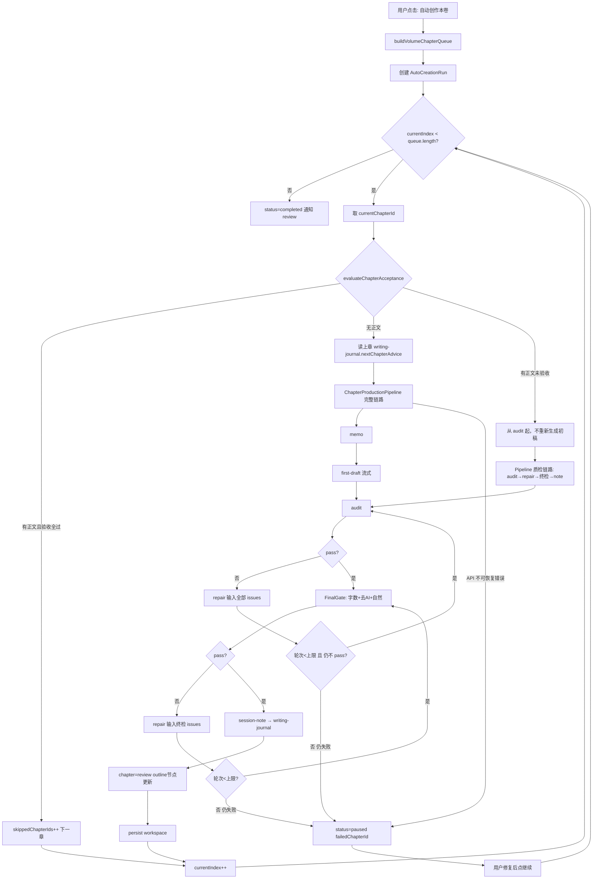

# auto-creation-mode design

## 0. 术语约定

| 术语 | 定义 | 防冲突结论 |
|---|---|---|
| **自动创作模式** | 用户在大纲面板触发、限定当前分卷的批处理写作任务 | 不与现有「全局助手」「outline-batch」混称；UI 文案用「自动创作」 |
| **分卷创作任务**（`AutoCreationRun`） | 一次从分卷首章跑到末章的 Runner 实例，含断点状态 | 新实体；不叫 batch / job |
| **章节生产流水线**（`ChapterProductionPipeline`） | 单章 memo→初稿→审计→修复→终检→session-note 的可复用编排 | 从 `useChapterFirstDraft` 抽出；单章按钮与批处理共用 |
| **上章下章建议**（`previousChapterAdvice`） | 上一章 `chapter-session-note` 写入 writing-journal 的 `nextChapterAdvice` 字段 | 读取 `knowledgeDocuments` 中 `sourceLabel=writing-journal` 且 `metadata.chapterId=prevChapterId` |
| **终检**（`FinalGate`） | 字数达标 + 去 AI 化 + 整章自然度三项自动确认 | 新编排步骤；可复用 audit + humanize 能力，不新增用户可见 fourth 按钮 |
| **章节验收通过**（`chapterAcceptanceSatisfied`） | 本章有正文 **且** 审计 pass **且** 终检三项全部 pass | **跳过条件**：二者同时满足才 skip；仅有正文但验收未过 → 不 skip，走修复流水线 |

---

## 1. 决策与约束

### 需求摘要

- **做什么**：用户在分卷大纲规划好后，一键自动按章推进完整 AI 写作流水线，直至本卷结束。
- **为谁**：已用 CharacterArc 维护分卷大纲、按节点规划章数与字数的创作者。
- **成功标准**：
  - 点击「自动创作」后，当前分卷从第一章顺序执行到最后一章；
  - **仅当**本章已有正文 **且** 验收条件（审计 pass + 终检：字数 / 去 AI / 自然度）**全部符合**时才跳过；有正文但未达标则进入审计/修复/终检，不重新从零生成初稿（除非 repair 需要）；
  - 每章使用上章「下章建议」增强初稿；审计不通过时用**全部**审计结论修复；终检三项通过后写 session-note 并进入下一章；
  - 不可恢复错误时暂停并记录断点，修复后可继续；
  - 整卷完成后通知用户 review。
- **明确不做**：
  - 不自动生成 / 修改剧情大纲结构；
  - 不跨分卷连续跑；
  - 不并行多章；
  - 不默认覆盖已有正文；
  - 不在卷内每章完成后弹窗等人确认；
  - 不把章节自动标为 `final` 定稿。

### 复杂度档位

走 **Electron 桌面应用 + Pinia 编排 + IPC 流式 AI** 默认档位，无偏离。

### 关键决策

| 决策 | 选择 | 理由 |
|---|---|---|
| 队列粒度 | **分卷内章节顺序**（非大纲节点顺序） | 用户按章推进；节点可拆多章，已有 `outlineChapterSplit` |
| 缺章时 | 按大纲节点规划**自动建章**再写 | 避免用户先手动逐节点点「创建章节」 |
| 串行 | 强制串行 | `previousChapterHandoff` / 下章建议依赖前章产物 |
| 审计修复 | **全部 issues** 输入 repair，可多轮直到 pass 或达上限 | 用户明确要求；现状只修 critical |
| 终检 | 独立编排步骤：字数 + 去 AI + 自然度 | 三项自动确认后才进下一章 |
| 跳过条件 | **章节验收通过**才 skip | 不是「有字就跳」；有正文未达标 → 质检修复直至通过或暂停 |
| 失败 | **暂停 + 持久化断点** | 用户确认；不静默跳过 |
| 完成态 | 章节 `review`，大纲节点 `drafting`→`done`（该节点下所有章验收通过后） | 卷末统一 review，非逐章确认 |

### 前置依赖

无。P0 可在 `feature/auto_mode_develop` 直接实现。

---

## 2. 名词与编排

### 2.1 名词层

#### AutoCreationRun（新实体）

**现状**：无。

**变化**：新增 Runner 状态实体，Pinia 持有，并同步写入 `localStorage`（key: `characterarc:auto-creation-run`）实现刷新后续跑。

```typescript
// 来源：新增 renderer/src/features/autoCreation/types.ts

type AutoCreationRunStatus =
  | 'idle' | 'running' | 'paused' | 'completed' | 'failed'

type AutoCreationPauseReason =
  | 'user' | 'api_error' | 'config_error'

type AutoCreationChapterStep =
  | 'ensure-chapter'
  | 'load-advice'
  | 'memo'
  | 'first-draft'
  | 'audit'
  | 'repair'
  | 'final-gate'
  | 'session-note'
  | 'persist'

interface AutoCreationRun {
  id: string
  projectId: string
  volumeId: string
  status: AutoCreationRunStatus
  pauseReason?: AutoCreationPauseReason
  pauseMessage?: string
  config: AutoCreationConfig
  chapterQueue: string[]          // chapterId 有序列表
  currentIndex: number            // 指向 chapterQueue 中下一条待处理
  currentStep?: AutoCreationChapterStep
  startedAt: string
  updatedAt: string
  completedChapterIds: string[]
  skippedChapterIds: string[]
  failedChapterId?: string
}

interface AutoCreationConfig {
  skipIfAcceptanceMet: true       // 固定 true：有正文且验收通过才 skip
  maxAuditRepairRounds: number    // 默认 3
  maxFinalGateRounds: number      // 默认 2
  targetWordCountOverride?: number
  userPrompt: string
  enabledSkillIds: string[]
  selectedReferenceWorkIds: string[]
}
```

#### ChapterProductionPipeline（编排函数）

**现状**：`useChapterFirstDraft.ts` 内联实现 memo→first-draft→audit（仅 critical repair）→session-note；绑定 UI ref，不可批调。

**变化**：抽出纯 async 编排，供单章 UI 与 Runner 共用。

```typescript
// 来源：新增 renderer/src/features/autoCreation/chapterProductionPipeline.ts

interface ChapterPipelineInput {
  projectId: string
  chapterId: string
  config: FirstDraftConfig          // 复用现有类型
  previousChapterAdvice?: string    // 注入 memo / first-draft prompt
  signal: AbortSignal
  onProgress: (step: AutoCreationChapterStep, label: string) => void
}

interface ChapterPipelineResult {
  ok: boolean
  skipped?: boolean               // 章节验收已通过，无需处理
  finalContent?: string
  auditPass?: boolean
  finalGatePass?: boolean
  error?: string
}

// 输入 chapterId + config → 输出 ok/skipped/error
// 验收已通过：skipped=true
// 无正文：走完整 memo→初稿→… 流水线
// 有正文未验收：跳过 memo/初稿，从 audit→repair→终检 起
// API 失败：ok=false, error=...
```

#### FinalGateResult（终检，新值对象）

**现状**：`ChapterAuditPayload` 含 pass/issues，无独立「去 AI / 自然度」终检；`useChapterHumanize` 为选手动能力。

**变化**：终检编排层组合现有能力，输出统一结论：

```typescript
interface FinalGateResult {
  pass: boolean
  wordCountOk: boolean
  deAiOk: boolean
  naturalOk: boolean
  issues: string[]                // 合并三项未通过原因，供下一轮 repair 输入
}
```

实现策略（implement 自决细节）：先 `chapter-audit` 扩展 category 或二次轻量 audit 任务检查自然度；字数用 `parseChapterWordTarget` + 正文 plain text 比对；去 AI 走现有 humanize 流程或 audit category `ai-tone`。

#### 章节队列构建

**现状**：`OutlinePanel.resolveLinkedChapter` 按 `outlineItemId` 找章；`createChapterFromOutlineItem` 一次建一章；同节点多章靠重复创建 + `outlineChapterSplit`。

**变化**：新增 `buildVolumeChapterQueue(volumeId)`：

1. 取分卷内 `outlineItems` 按 `sort_order`；
2. 对每个节点，读取已有关联章节（同 `outlineItemId`），按卷内顺序排列；
3. 若节点规划 N 章但不足 N 个实体章，按 `outlineChapterSplit.totalParts` **补建空章**（标题/摘要/wordTarget 从节点与 split 索引推导）；
4. 合并为分卷全局章节顺序列表（按 outline 顺序 + 同节点内章节顺序）。

---

### 2.2 编排层

#### 主流程图



#### 现状

- 单章：`useChapterFirstDraft.start()` 仅在 Chapter Studio 手动触发。
- 审计修复：仅 `severity=critical` 走 `chapter-repair`（`useChapterFirstDraft.ts:605-631`）。
- 无批处理 Runner、无断点续跑、无终检三步合并。

#### 变化

| 步骤 | 变化 |
|---|---|
| 触发 | 大纲面板新增「自动创作本卷」→ 配置弹窗（复用初稿配置字段）→ 启动 Runner |
| 队列 | 新增 `buildVolumeChapterQueue`，缺章自动补建 |
| 跳过 | 调用 `evaluateChapterAcceptance(chapterId)`：**有正文且审计+终检全过** → skip；有正文未过 → 质检链路；无正文 → 完整链路 |
| 上章建议 | 流水线开始前读 prev chapter 的 journal，写入 `previousChapterAdvice` |
| 审计 | 不 pass → **全部** `audit.issues` 格式化进 repair；最多 `maxAuditRepairRounds` |
| 终检 | audit pass 后执行 FinalGate；不 pass → repair → 重检，最多 `maxFinalGateRounds` |
| 失败 | `status=paused`，记录 `failedChapterId` + `currentStep` + `pauseMessage`；UI 显示「继续」 |
| 完成 | 卷内队列跑完 → toast/通知 + Run 状态 completed；章节保持 `review` |

#### 流程级约束

- **顺序**：Runner 同时只允许一个 `AutoCreationRun` per project。
- **幂等**：验收已通过的章 skip；有正文未验收的章只跑质检不覆盖初稿（除非 repair 输出新稿）。
- **取消**：用户点停止 → `paused` + `pauseReason=user`，可继续或放弃。
- **可观测**：全局 AI 任务注册表登记 key `auto-creation:{runId}`，进度文案含 `第 i/n 章 · 步骤名`。
- **错误语义**：网络/API 错误 → 暂停，不自动 skip；终检/审计超限仍不 pass → 暂停并附 issues 摘要，等人调配置后继续。

---

### 2.3 挂载点清单

| 挂载位置 | 动作 |
|---|---|
| `OutlinePanel.vue` 分卷标题区 | **新增**「自动创作本卷」按钮 |
| `AutoCreationConfigDialog.vue`（新组件） | **新增**配置弹窗入口 |
| 全局 AI 进度 / `appStore.runTrackedAiTask` | **新增** task key `auto-creation:{runId}` |
| `localStorage` key `characterarc:auto-creation-run` | **新增**断点持久化 |
| 大纲面板 / 章节树 | **新增** Runner 进行中进度条与暂停/继续/停止控件 |

本 feature 不新增 SQLite 表（V1）；不新增 IPC channel（复用现有 stream AI）。

---

### 2.4 推进策略

1. **微重构**：从 `useChapterFirstDraft.ts` 抽出 `ChapterProductionPipeline`（行为不变），单章手动流程改调 Pipeline → 编译 + 手动点一次初稿验证无回归。
2. **编排骨架**：`AutoCreationRunner` + 类型 + 队列构建 + localStorage 持久化；stub Pipeline → 能 start/pause/resume/complete。
3. **Pipeline 增强**：全量 audit repair 循环 + FinalGate + 上章 advice 注入 + session-note。
4. **Runner 接通**：Runner 调真实 Pipeline，串行跑队列，处理 skip/pause。
5. **UI**：大纲按钮 + 配置弹窗 + 进度条 + 卷完成 review 通知。
6. **验收**：用 `samples/projects/` 样例分卷跑通 2–3 章（可 mock 缩短）。

---

### 2.5 结构健康度与微重构

#### 评估

- **文件级 — `renderer/src/components/chapterWorkspace/useChapterFirstDraft.ts`**：~735 行；混编排 + UI ref + stream 监听；本次需复用于 Runner。
- **文件级 — `renderer/src/components/OutlinePanel.vue`**：~1500 行；已偏胖；本次仅加按钮与进度 UI，改动 1 处入口。
- **目录级 — `renderer/src/features/`**：已有 `novelWorkflow/`、`ai/` 等；无 `autoCreation/`；本次新增 3–4 文件，不挤。

#### 结论：微重构（拆文件）

##### 方案

- **搬什么**：`useChapterFirstDraft.ts` 内 memo→draft→audit→repair→note 编排逻辑及 helper（`formatMemoForRepair`、`buildReferenceStyleContext` 等）。
- **搬到哪**：`renderer/src/features/autoCreation/chapterProductionPipeline.ts` + `renderer/src/features/autoCreation/advice.ts`（读 writing-journal）。
- **行为不变怎么验证**：单章「生成初稿」手动流程跑通；`vue-tsc --noEmit` 绿灯。
- **步骤序列**：
  1. 新建 `features/autoCreation/`，搬编排纯函数；
  2. `useChapterFirstDraft` 改调 Pipeline，UI 层保留；
  3. 编译 + 手动验证单章初稿无回归。

##### 超出范围的观察

- `OutlinePanel.vue` 1500+ 行职责过重 → 建议后续 `cs-refactor` 拆 panel 子组件；**本 feature 不阻塞**。

---

## 3. 验收契约

### 关键场景清单

| # | 输入 / 触发 | 期望可观察结果 |
|---|---|---|
| 1 | 当前分卷 3 章均无正文，点「自动创作」 | 按顺序生成 3 章；每章经 audit+终检；第 2 章起 memo/初稿 context 含上章 nextChapterAdvice |
| 2 | 第 2 章有正文且 audit+终检均已 pass | 跳过第 2 章；第 1、3 章正常处理 |
| 2b | 第 2 章有正文但字数不达标 / 审计未 pass | **不跳过**；从 audit→repair→终检 质检链路处理，不重新 memo/初稿 |
| 3 | 审计返回 2 critical + 1 warning | repair 输入含 3 条 issue，而非仅 critical |
| 4 | 终检字数不足 | 自动 repair 后重检；通过才进下一章 |
| 5 | 第 2 章 first-draft API 失败 | Runner `paused`，显示失败章与步骤；点「继续」从第 2 章重试 |
| 6 | 卷内全部处理完 | 通知 review；章节 status=`review`；Run status=`completed` |
| 7 | 刷新页面后 | localStorage 断点仍在，可继续 |
| 8 | 用户点停止 | Run `paused`，已完成章内容保留 |

### 明确不做的反向核对

- 代码中不应出现跨 `volumeId` 的队列构建。
- 不应默认覆盖已有正文（无正文走完整链路；有正文未验收走质检链路，不主动从零重写）。
- 卷内不应出现 `chapter.status='final'` 的自动赋值。
- 不应新增 `outline-batch` 或修改大纲结构的自动逻辑。

---

## 4. 与项目级架构文档的关系

- 关联 `.codestable/compound/2026-07-04-explore-novel-creation-workflow.md`（创作流程探索）。
- acceptance 后建议在 `ARCHITECTURE.md` §3 增加子系统索引：**自动创作 Runner**（`renderer/src/features/autoCreation/`）。
- 名词 `AutoCreationRun` / `ChapterProductionPipeline` 属模块内可见，系统级仅多一个「分卷批处理写作」能力描述。

---

> 方案 doc 已起草完成，请整体 review。确认后 `status` 改为 `approved` 并进入 `cs-feat-impl`。
