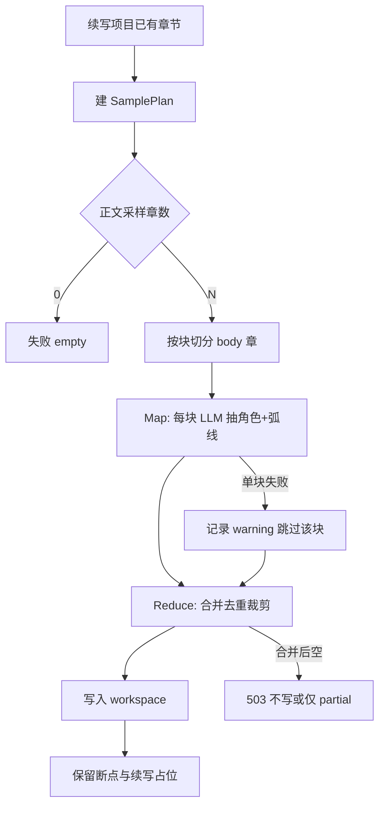

# continuation-reverse-extract design

## 0. 术语约定

| 术语 | 定义 | 防冲突结论 |
|---|---|---|
| **作品续写** | 已落地的导入半成品 + 断点 + 自动创作能力（`2026-07-17-novel-continuation`） | 本 feature **依赖**其 seed/断点，不重做导入 |
| **反推设定**（`ContinuationReverseExtract`） | 从已导入章节正文归纳角色卡与已发生大纲，并写入工作区 | 产品文案用「从正文反推设定」；不叫「拆书」（拆书库是参考书仿写） |
| **状态补录**（已有 `state-backfill`） | 逐章提取 story-state 差分写入状态库 | **不合并**：补录管「状态时间线」，反推管「人物卡 + 大纲结构」；可先后跑 |
| **project-bootstrap**（已有） | 凭简介生成首批世界观+3 条大纲（从零开书） | **不复用其语义**：反推是「从已有正文归纳」，bootstrap 是「从简介生成」 |
| **character-card / outline-batch**（已有） | 从零生成单角色 / 批量细纲 | 可作 prompt 风格参考，**不直接当入口任务**（输入不是「生成新设定」而是「读正文归纳」） |
| **已发生大纲** | 对应已导入章节的回顾性 outline 节点（status 偏 `done`） | 区别于「续写（待写）」未来占位节点；反推默认**不发明未发生的未来细纲** |

---

## 1. 决策与约束

### 需求摘要

- **做什么**：续写项目有正文后，一键（或向导可选步骤）用 AI 反推 **主要角色卡** + **已发生大纲结构**，写入 `characters` / `outlineVolumes` / `outlineItems`，让续写不再只有「已导入正文」占位。
- **为谁**：刚导入半成品、人物/大纲面板仍空、想尽快用自动创作的作者。
- **成功标准**（可验证）：
  1. 续写向导或工作台续写条有「反推设定」入口；可跳过。
  2. 对已导入 ≥3 章的项目，反推完成后：角色图鉴 ≥1 张可用卡；大纲区出现可理解的已发生节点（非仅「已导入正文」单节点）。
  3. 已导入章节正文**不变**；断点 `ContinuationBreakpoint` 不变。
  4. 千章级作品不 OOM、不一次塞全文进模型：采样策略可配置，默认有上限。
  5. 失败可重试；失败不破坏已导入正文与既有角色/大纲（见写入策略）。
- **明确不做（本版）**：
  - 不做「未来 100 章细纲」自动规划（续写占位仍由用户/自动创作扩展）。
  - 不做与 `state-backfill` 合并成一次调用。
  - 不做 epub/pdf、不做 chat 里说「帮我拆设定」。
  - 不改章节助手、不改拆书库入口。
  - 不做 Electron 独立向导（与续写 MVP 一致：**Web + server**）。
  - 不做组织 membership 自动建图（关系网做角色边，不做组织树）。

### 复杂度档位

走 **Web/server 编排 + 既有 AI task 注册** 默认档位。

偏离点：

- **AI 深度 = 中（偏离「仅规则/单次 bootstrap」）**：map（分块抽取）+ reduce（合并），因千章无法单次上下文。
- **写入策略 = 可配置覆盖（偏离「永远静默覆盖」）**：默认「空则写 / 非空则合并去重」；用户可选「强制重建大纲中的已导入区」。

### 关键决策

| 决策 | 选择 | 若换做法会怎样 |
|---|---|---|
| 与续写关系 | **续写后可选步骤**，独立 feature | 塞进 seed 同步会拉长导入、且 AI 失败会模糊「导入是否成功」 |
| 与状态补录关系 | **并列可选**，不互相替代 | 合并一次 LLM 既难 schema 又难失败恢复 |
| 大纲范围 | **只反推已发生**（贴导入章） | 若同时发明未来细纲，易与用户意图冲突且难验收 |
| 章节绑定 | **尽量 1 大纲节点 : 多章** 或 **按卷/弧线聚合**，不强制 1:1 千节点 | 1:1 会生成上千 outlineItem，UI 不可用 |
| 长文策略 | **分层采样 + 分块抽取 + 合并** | 全文塞模型不可行；只读前 3 章会丢后期人物 |
| 写入 | **合并进现有 workspace**；保留「续写（待写）」占位 | 清空全部大纲会毁掉续写队列 |
| 平台 | **Web API + 向导/横幅按钮** | 桌面可后挂同一 task |

### 已拍板

1. 采样：开篇 + 中段均匀 + 末段 + 标题索引；默认 maxBodyChapters=24。
2. 角色 ≤12；弧线大纲 ≤30；世界观完整（默认 ≤12 词条）；**完整角色关系网**（默认 ≤40 边）。
3. 向导「创建后反推」**默认不勾选**；工作台横幅常驻「反推设定」。
4. API 默认 `rebuildImportedOutline=true`（替换「已导入正文」占位，保留「续写（待写）」）。
5. 平台：**Web + server only**。

### 前置依赖

- 硬依赖：`2026-07-17-novel-continuation` 的 seed / breakpoint / 导入章节。
- 软依赖：现有 `runAiTask` / task 注册、Web `ai/*` 或 continuation 路由、workspace 写回。

---

## 2. 名词与编排

### 2.1 名词层

#### 现状

- 导入后项目：`chapters[]` 有正文；`outlineVolumes` 默认一卷；`outlineItems` 仅「已导入正文」+「续写（待写）」；`characters` 通常为空。  
  // 来源：`server/src/continuation/seed-project.ts` `buildContinuationSeed`
- 角色卡：`CharacterCard`（id/name/role/description/avatar/tags）。  
  // 来源：`renderer/src/types/app.ts` `CharacterCard`
- 大纲：`OutlineVolume` / `OutlineItem`（volumeId/title/wordTarget/conflict/summary/status/sortOrder）。  
  // 来源：同文件
- 状态补录：`backfillProjectStateFromChapters` 写 story-state，**不写** characters/outline。  
  // 来源：`electron/main/ai/state-backfill.ts`
- bootstrap：简介 → 3 世界观 + 3 大纲，与正文无关。  
  // 来源：`electron/main/ai/tasks/project-bootstrap.ts`

#### 变化

| 动作 | 名词 | 动机 |
|---|---|---|
| 新增 | `ReverseExtractSamplePlan` | 描述采样：哪些章带正文、哪些只标题 |
| 新增 | `ReverseExtractChunkResult` | 单块 LLM 输出：局部角色/弧线 |
| 新增 | `ContinuationReverseExtractResult` | 合并后：characters + volumes + items + warnings |
| 新增 | AI task `continuation-reverse-extract`（或 map/reduce 两个子任务） | 与 bootstrap/card 语义分离 |
| 新增 | API `POST .../continuation/reverse-extract` | Web 触发 + 进度 |
| 可选元数据 | knowledge / 断点旁记录 `reverseExtractedAt` | 可观测、避免重复全量 |

#### 接口示例

**1）采样计划（纯函数）**

```
输入: chapters[{id,title,plainOrHtml, index}], options{ maxBodyChapters: 24, head: 8, tail: 4, mid: 12 }
输出: {
  titleIndex: [{ index, title }],          // 全量或截断列表
  bodyChapterIds: string[],               // 带正文送模型的章
  warnings: string[]                      // 如「全书 1204 章，仅采样 24 章正文」
}
```

// 来源建议：`electron/shared/continuation/reverse-sample.ts`（新）

**2）反推 API**

```
POST /api/character-arc/v1/projects/:projectId/continuation/reverse-extract
body: {
  maxBodyChapters?: number,     // 默认 24
  maxCharacters?: number,       // 默认 12
  maxOutlineItems?: number,     // 默认 30
  rebuildImportedOutline?: boolean,  // 默认 false=合并
  skipIfAlreadyExtracted?: boolean
}
→ 202/200 { success, result: ContinuationReverseExtractResult & { applied: true } }
→ 400 empty_chapters | 404 project | 503 ai_failed（正文保留）
```

// 来源：新 `server/src/routes/continuation.ts` 扩展；AI 走现有 user-workspace runner

**3）合并结果形状**

```
{
  characters: [{ name, role, description, tags[] }],
  outlineVolumes: [{ title, summary, wordTarget? }],
  outlineItems: [{ volumeTitleOrIndex, title, conflict, summary, status: 'done', linkedChapterIndexRange?: [from,to] }],
  warnings: string[],
  sample: { totalChapters, sampledBodyCount }
}
```

写入时映射为真实 id，并：

- 保留「续写（待写）」类 `planned` 节点（按 title 或 metadata 识别）。
- `rebuildImportedOutline=true` 时删除/替换 status=`done` 且来自导入区的旧占位「已导入正文」。
- 角色按 `name` 去重合并（同名更新 description 较长者优先，或保留用户已有）。

### 2.2 编排层

#### 主流程图



#### 现状

- 导入 → 可选 backfill → 工作台；大纲几乎空。  
- 无「从正文归纳设定」的统一任务。

#### 变化

1. 在续写向导末步增加勾选「创建后反推设定」（默认开或关：**假设默认关**，因耗 token；与 backfill 并列）。
2. 工作台续写 banner 增加「反推大纲/角色」按钮 → 调 API，进度条/toast。
3. Server：读 workspace 章节 → 采样 → map/reduce AI → 写回 characters/outline → persist。
4. 不改自动创作 skip 语义；反推后 outline 更丰满，**有助于**后续人工改「续写（待写）」目标。

#### 流程级约束

| 约束 | 说明 |
|---|---|
| 错误 | AI 失败 → 不回滚已导入章节；返回 warnings/errors；可重试 |
| 幂等 | 默认合并；同名角色不双倍爆炸；`skipIfAlreadyExtracted` 可短路 |
| 顺序 | 与 backfill 无强制顺序；建议文案：先反推设定 / 或先补录状态均可 |
| 并发 | 同一 project 同时只允许一个 reverse-extract（简单 in-memory/DB 锁或「进行中」标记） |
| 可观测 | progress：sampling / map i/n / reduce / applying |
| 扩展 | 日后可加 worldview 抽取为第二 task，不堵本版 |

### 2.3 挂载点清单

1. **API**：`POST /projects/:id/continuation/reverse-extract` — 新增  
2. **AI task 注册**：`continuation-reverse-extract`（及可选 chunk 子任务）— 新增  
3. **Web 向导**：`ContinuationWizardView` 可选步骤 — 修改  
4. **工作台横幅**：`WorkbenchPage` continuation banner 按钮 — 修改  
5. **进度通道**（若复用现有 progress bus）：`reverseExtract` channel — 新增或复用通用 progress  

（不列内部 helper / prompt 文件。）

### 2.4 推进策略

1. **采样纯函数 + 结果类型**  
   退出：给定 1204 章 mock 得到稳定 body 子集与 titleIndex  
2. **AI task map/reduce + normalize/validate**  
   退出：固定样例正文块 → 合法 JSON 角色/大纲  
3. **Server apply 写入 workspace**（保留断点与续写占位）  
   退出：seed 项目跑 API 后 characters/outline 非空且 chapters 正文 hash 不变  
4. **Web 入口**（向导勾选 + banner）+ 进度  
   退出：UI 可触发并看到完成/失败  
5. **E2E**：爆裂天神前 20 章项目上跑反推（限采样）  
   退出：≥1 角色、≥3 已发生大纲节点  

### 2.5 结构健康度与微重构

- **本次不做微重构**。  
  原因：续写相关文件仍小；新逻辑落 `electron/shared/continuation/*` 与 `server/src/continuation/*` 新文件，不往 `seed-project.ts` / `WorkbenchPage.vue` 塞大段算法。  
- **超出范围的观察**：`WorkbenchPage.vue` 已偏大，banner 只加按钮；若再堆面板应后续 `cs-refactor`。

---

## 3. 验收契约

### 关键场景

| ID | 触发 | 期望 |
|---|---|---|
| R1 | 3 章短项目 + 反推 | ≥1 角色；大纲出现已发生节点；正文不变 |
| R2 | 20 章爆裂天神子集 + 默认采样 | 有主角向角色；warnings 可含采样说明；断点不变 |
| R3 | 已有手改角色后再反推（合并） | 不无故清空用户角色；同名合并可接受 |
| R4 | `rebuildImportedOutline=true` | 「已导入正文」占位被结构化节点替换；「续写（待写）」仍在 |
| R5 | AI 失败 / 无 Key | 503 或明确错误；chapters 仍在 |
| R6 | 0 章项目 | 400，不调模型 |

### 反向核对

- [ ] 未把反推入口塞进拆书库  
- [ ] 未修改 chapter-assistant continue 语义  
- [ ] 未强制与 state-backfill 绑死同一次调用  
- [ ] 未生成强制未来百章细纲  

---

## 4. 与项目级架构文档的关系

- 验收后在 `ARCHITECTURE.md` 的 AI/续写相关小节一句：续写后可选 `continuation-reverse-extract`。  
- 不新建子系统；归属 **continuation + AI tasks**。

---

## 实现落点（摘要）

- `electron/shared/continuation/reverse-sample.ts` — 采样
- `electron/main/ai/tasks/continuation-reverse-extract.ts` — AI 任务
- `server/src/continuation/reverse-extract.ts` — 编排写回
- `POST /api/character-arc/v1/projects/:id/continuation/reverse-extract`
- Web：向导勾选 / `?reverseExtract=1` / 工作台横幅「反推设定」
