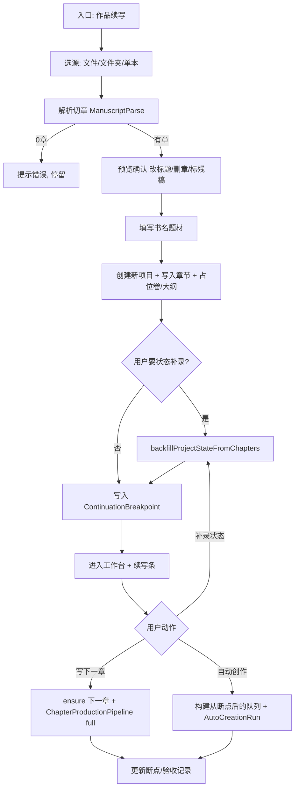

# novel-continuation design

## 0. 术语约定

| 术语 | 定义 | 防冲突结论 |
|---|---|---|
| **作品续写**（`NovelContinuation`） | 从外部半成品/已有项目正文导入后，定位断点并继续生产后续章节的产品能力 | UI 文案用「作品续写」；不叫「导入小说」（那是拆书库仿写） |
| **续写向导**（`ContinuationWizard`） | 新建作品时与「新书向导」并列的入口，走导入→预览→补状态→进入工作台 | 不复用 `ProjectWizardPage` 的 deep/quick/off 骨架生成路径 |
| **原稿导入**（`ManuscriptImport`） | 把 txt/md/文件夹/整本正文切成 `ChapterDraft[]` 并写入新项目 | 区别于 `.carc` 归档导入、JSON 模块导入、参考书拆书导入 |
| **断点章**（`continuationBreakpoint`） | 导入后判定的「已完成最后一章」；续写从下一章开始 | 残稿（最后一章未写完）用户二选一：补完残章 / 从下一空章起写 |
| **章节续写**（已有） | 章节助手 mode=`continue`，续当前章一小段 | **保留原名**；本 feature 不改它，产品文案避免混称 |
| **自动创作**（已有 `AutoCreationRun`） | 卷内按队列跑 `ChapterProductionPipeline` | 续写阶段**复用** Runner，不新建第二套批处理引擎 |
| **状态补录**（已有 `state-backfill`） | 对已有章节逐章提取 story-state | 续写向导把补录当作导入后的默认推荐步骤，不重写提取逻辑 |

---

## 1. 决策与约束

### 需求摘要

- **做什么**：让用户把已有半成品小说（多章 txt/md 或文件夹）导入 CharacterArc，自动切章入库，可选补录故事状态，再从断点起用现有「章节生产 / 自动创作」继续往下写。
- **为谁**：已在站外/旧工具写了一截、想迁入 CharacterArc 继续连载的网文作者。
- **成功标准**（可验证）：
  1. 项目中心有「作品续写」入口；走完向导后得到**含正文的新项目**（≥1 章、字数与源文件一致量级）。
  2. 导入支持：多文件、文件夹、单文件整本（按 `第N章` 类分隔符切分）；章号/标题可预览、可改。
  3. 导入后可一键触发状态补录；补录进度可观察；失败不丢已导入正文。
  4. 工作台可见断点摘要（已导入到第 N 章 / 下一章待写）；用户可对「下一章」点生成初稿，或对当前卷启动自动创作（从断点后空章/队列位置开始，不默认重写已有正文）。
  5. 已验收/已有正文的章节在自动创作中仍遵循现有 skip / quality-only 语义，**不因续写模式整章覆盖**。
- **明确不做（MVP）**：
  - 不做「对话里说继续写下一章」的自然语言任务路由（青幕 chat router）；入口是向导 + 按钮。
  - 不做自动从正文反推完整大纲 / 人物卡 / 世界观（可后续 feature；MVP 只保正文 + 可选 story-state）。
  - 不做 epub/pdf 解析；不做网文站点抓取。
  - 不把拆书库「导入小说」改成续写（仿写与续写入口分离）。
  - 不改章节助手「续写片段」语义。
  - 不做跨项目合并续写、不做残章 AI 自动补全为独立流水线（残章仅标记 + 用户选择）。

### 复杂度档位

走 **Electron 桌面应用 + Pinia 编排 + 既有 IPC/AI 任务** 默认档位。

偏离点：

- **数据导入路径 = 产品级（偏离「纯内部增强」）**：新增向导入口与预览确认，原因：续写是获客级能力，不能埋在设置 JSON 导入里。
- **AI 深度 = 浅（偏离「导入即全量逆向工程」）**：MVP 不做 story-import skill 级拆解管道，原因：周期与稳定性；状态补录复用现成 `backfillProjectStateFromChapters` 即可接住记忆。

### 关键决策

| 决策 | 选择 | 若换做法会怎样 |
|---|---|---|
| 入口形态 | **新建「作品续写」向导**（与新书向导并列） | 塞进 `ProjectWizardPage` 会污染新书三步流；塞进设置导入则无断点/补录编排 |
| 导入落点 | **始终创建新项目**（不覆盖当前项目） | 覆盖现有项目风险高；与 `.carc` 的 overwrite 模式刻意区分 |
| 切章策略 | **规则优先**（文件名章号 / `第N章` 标题行），失败再整文件一章 | 一上来就 LLM 切章成本高且难验收；规则覆盖 90% 网文源 |
| 记忆 | **默认推荐状态补录**，用户可跳过 | 强制补录会在大书导入时阻塞「先能看正文」；跳过后仍可从知识面板补录 |
| 续写执行 | **复用 `ChapterProductionPipeline` + `AutoCreationRun`** | 另起「续写引擎」会双轨维护审计/修复/润色 |
| 大纲 | **MVP 自动建「默认卷 + 占位 outline 节点」绑定导入章**；不 AI 生成后续细纲 | 无 outline 则自动创作队列难建；AI 大纲另开 feature |
| 对标青幕 | 学其「导入章节 + 记忆摄取 + 从 N+1 写」；不抄 chat 路由与拆书混入口 | 全抄 chat 要动全局助手意图层，范围过大 |
| 平台范围 | **仅 Web 端实现**（`web/` 向导 + `server/` API + 共享 `electron/shared/continuation`）；不新增 Electron 桌面向导 | 桌面可后续复用同一套 parse/seed 与断点契约 |

### 假设（请拍板）

1. **假设（已拍板）**：MVP **只做 Web**——多文件上传切章 + 服务端 seed；不强制桌面文件夹选择。
2. **假设**：导入源主要是简体网文章节命名（`第12章 xxx`、`012-标题.txt`），英文 `Chapter 12` 一并支持。
3. **假设**：用户接受「先有正文再补设定」——续写初期大纲可能比新书瘦。
4. **假设**：残稿最后一章默认标记为「未完成」，用户选择「当已完成」或「打开编辑器自己补」；MVP 不自动 AI 补残章。

### 前置依赖

无硬依赖。软依赖：现有 `state-backfill`、`autoCreation`、`importProjectData` / 章节实体结构可用。

---

## 2. 名词与编排

### 2.1 名词层

#### ManuscriptImportSource / ParseResult（新）

**现状**：无产品级原稿导入。仅有：

- `.carc` / JSON 项目导入（`SettingsPanel` + `appStore.importProjectData`）
- 参考书导入（拆书，不进章节库）
- skill 层 `resources/skills/.../story-import`（Agent 手工，无 UI）

**变化**：新增纯解析模块（无 AI）产出可预览结构：

```typescript
// 来源：新增 renderer 或 electron/shared 的 manuscript-import 模块

type ManuscriptImportSourceKind = 'files' | 'folder' | 'single-book'

interface ManuscriptImportSource {
  kind: ManuscriptImportSourceKind
  paths: string[]           // 桌面本地路径
  encodingHint?: 'utf-8' | 'gbk' | 'auto'
}

interface ParsedChapterCandidate {
  index: number             // 1-based 展示序
  detectedNumber: number | null
  title: string
  plainText: string
  sourcePath?: string
  charCount: number
  isPartial?: boolean       // 用户可标残稿
}

interface ManuscriptParseResult {
  detectedTitle?: string
  chapters: ParsedChapterCandidate[]
  warnings: string[]        // 如：未识别章号、编码可疑、空文件跳过
}

// 示例：输入 3 个 txt → 输出 3 个 candidate，index 1..3
// 示例：单文件含「第1章…第2章…」→ 输出 2 个 candidate
// 错误：0 个可读章节 → warnings + chapters=[]，向导禁止下一步
```

#### ContinuationProjectSeed（新）

**现状**：`createProjectWorkspaceSeed` / spiral seed 从 premise 生成空骨架。

**变化**：新增从 `ManuscriptParseResult` + 用户确认元数据生成 `ProjectImportPayload` 等价结构（项目 + 默认卷 + 章节 + 可选占位 outline）：

```typescript
// 来源：新增 features/continuation/continuationSeed.ts

interface ContinuationSeedInput {
  title: string
  genre: string
  novelLength?: NovelLength
  chapters: ParsedChapterCandidate[]  // 用户可在预览改 title / 删章 / 调序
  markLastAsPartial: boolean
}

interface ContinuationSeedResult {
  projectId: string
  volumeId: string
  chapterIds: string[]
  breakpoint: ContinuationBreakpoint
}

// 输入：title=「旧书」, chapters=已确认 18 章
// 输出：新项目，chapters[0..17] 有 content，breakpoint.completedThroughIndex=18
```

#### ContinuationBreakpoint（新，可落在 project metadata 或本地轻量表）

**现状**：无断点实体；自动创作靠 `currentIndex` + 验收记录跳过。

**变化**：

```typescript
interface ContinuationBreakpoint {
  projectId: string
  volumeId: string
  /** 已导入且视为完成的最大章序（分卷内 1-based） */
  completedThroughIndex: number
  lastCompletedChapterId: string | null
  nextChapterId: string | null       // 若已预建空章；否则 null=需 ensure-chapter
  lastChapterPartial: boolean
  importedAt: string
  sourceSummary: string              // 如「18 章 · 约 12 万字 · 文件夹导入」
}
```

持久化建议（实现自决其一，design 只定语义）：

- 写入项目级 metadata / `app_settings` 旁路 JSON，或
- `knowledgeDocuments` 一条 `sourceLabel=continuation-breakpoint`

读取方：工作台续写条、自动创作启动时默认 `startIndex`。

#### 复用实体（不改核心语义）

| 实体 | 现状职责 | 本 feature 用法 |
|---|---|---|
| `ChapterDraft` | 项目章节 | 导入写入 content |
| `state-backfill` | 逐章提取状态 | 向导步骤调用 |
| `AutoCreationRun` | 卷内批处理 | 从断点后队列启动；config 可带 `startFromChapterId` 或由队列构造时剔除已完成章 |
| `ChapterProductionPipeline` | 单章生产 | 下一章生成与自动创作共用 |

**可选增强（若实现成本低）**：`AutoCreationConfig` 增加 `startChapterId?: string` 或构造队列时传入 `fromIndex`——语义是「队列起点」，不是新引擎。

#### 前端组件（新）

```
ContinuationWizardPage
  ├─ StepSource      选文件/文件夹/单本
  ├─ StepPreview     章列表预览、改标题、删/调序、标残稿
  ├─ StepMeta        书名/题材
  └─ StepBootstrap   创建项目 → 可选补录 → 进入工作台

WorkbenchContinuationBanner（工作台顶条，仅 continuation 项目显示）
  - 展示断点 + 「写下一章」+ 「自动创作（从断点后）」+ 「补录状态」
```

状态归属：向导本地 `ref`；成功后断点进项目持久化；补录进度复用现有 backfill progress 通道。

### 2.2 编排层

#### 主流程图



#### 现状

```
新书: ProjectWizard → seed/spiral → 空/骨架项目 → 工作台 → 手动或自动创作
导入: 设置 .carc/JSON → importProjectData（无切章、无断点、无补录编排）
补录: 知识面板 backfill（要求章节已在库）
自动创作: 卷队列 → 验收 skip 或 full/quality-only 流水线
章节助手 continue: 仅段内续写
```

#### 变化

1. **新增旁路入口** `ContinuationWizard`，不替换新书向导。
2. **在「有章节」之后串联** 可选 `state-backfill`（同一套 IPC）。
3. **写入断点**，工作台根据断点展示续写条。
4. **自动创作启动**：若存在断点，默认队列从 `completedThroughIndex+1` 起（已完成且验收通过的章仍按现逻辑 skip；有正文未验收走 quality-only，不强制重写）。
5. **单章「写下一章」**：`ensure-chapter`（若无空章）→ `ChapterProductionPipeline` mode=`full`，上下文必须带上章结尾/状态（复用现有 context builder）。

#### 流程级约束

| 约束 | 约定 |
|---|---|
| 错误语义 | 解析失败不建项目；建项目成功后补录失败 → 项目保留 + 错误列表，可重试补录 |
| 幂等 | 同一源重复导入 → 新项目（不合并）；补录对已处理章可 skip（沿用 backfill 现有行为） |
| 并发 | 向导内禁止并行二次创建；补录与自动创作互斥（沿用自动创作 running 锁） |
| 正文保护 | 导入章默认 `content` 只读于「自动创作 full 初稿」路径：有正文且未要求 quality-only 时不得当空章重写；与现网 auto-creation 语义对齐并在续写条文案写清 |
| 可观测 | 解析 warnings、导入章数/字数、补录 progress、断点摘要 |
| 扩展点 | 后续可插：AI 大纲反推、残章补全流水线、Web 上传、chat「继续写下一章」路由 |

### 2.3 挂载点清单

| # | 挂载位置 | 动作 |
|---|---|---|
| 1 | 项目中心 / 路由：`ContinuationWizard` 入口与路由表 | 新增 |
| 2 | 工作台顶栏或概览：`WorkbenchContinuationBanner`（有断点才显示） | 新增 |
| 3 | 桌面 IPC/preload：选文件/文件夹读文本、（若解析放 main）`parseManuscript` | 新增或扩展现有 file 对话框 API |
| 4 | 项目持久化：`ContinuationBreakpoint` 存储 key / 表字段 / knowledge 文档类型 | 新增 |
| 5 | 自动创作启动参数：队列起点（`fromIndex` / `startChapterId`） | 修改启动入口 |

删掉 1–5，用户侧「作品续写」能力消失；内部 parse helper 不单列。

### 2.4 推进策略

1. **解析纯函数**：文件/文件夹/整本切章 + 预览数据结构  
   退出：给定样例源得到稳定 `ParsedChapterCandidate[]`（单测或脚本）
2. **ContinuationSeed + 断点持久化**：确认列表 → 新项目含正文  
   退出：手工导入 3 章样例，工作台能打开并见正文
3. **向导 UI 四步**：源→预览→元数据→创建/补录  
   退出：桌面走通一次完整导入
4. **串联状态补录**：向导可选 + 工作台重试  
   退出：补录 progress 与结果可观察，失败可重试
5. **续写执行**：断点条「写下一章」+ 自动创作从断点后起跑  
   退出：第 N 章已导入时能产出第 N+1，且不覆盖第 1..N 正文
6. **验收收尾**：对照第 3 节场景 + 文案防与「章节续写」混淆  
   退出：验收清单可勾选

### 2.5 结构健康度与微重构

##### 评估

- **compound convention**：检索无「续写/导入目录」类 convention；无强制归属。
- **文件级**  
  - `ProjectWizardPage.vue`：已很大；**本 feature 不往里塞**，新开 `ContinuationWizardPage`。  
  - `SettingsPanel.vue`：已有导入导出；不把原稿导入塞进设置。  
  - `autoCreation/*`：仅扩展队列起点，避免改 pipeline 核心语义。  
  - `state-backfill`：只调用，不拆文件。
- **目录级**  
  - 新模块建议 `renderer/src/features/continuation/`（parse 可放 `electron/shared/continuation/` 若桌面/Web 要共享）。  
  - `pages/` 仅新增 1 个页面，不触发重组。

##### 结论：不做微重构

原因：主体落在新目录/新页面；对自动创作只做参数级扩展；无「只搬不改行为」的必要前置。

##### 超出范围的观察

- `story-import` skill 与产品导入长期双轨，后续可考虑「深度逆向」（大纲/人设反推）独立 roadmap，不阻塞本 MVP。
- `ProjectWizardPage` 体量偏大，若未来合并「新书/续写」入口，应走 `cs-refactor`，本 feature 不合并。

---

## 3. 验收契约

### 关键场景

| # | 触发 | 期望 |
|---|---|---|
| N1 | 选 3 个 `01.txt`…`03.txt` 完成向导 | 新项目 3 章，正文与源一致量级，断点 completedThroughIndex=3 |
| N2 | 选单文件含「第1章」「第2章」标题 | 解析为 2 章，预览可改标题后入库 |
| N3 | 导入后勾选状态补录 | progress 走到 done；story-state 非空或明确 partial 失败列表 |
| N4 | 工作台点「写下一章」 | 出现第 4 章（或下一空章）并跑生产流水线；第 1–3 章 content 不变 |
| N5 | 从断点启动自动创作，maxChapters=1 | 只处理断点后一章；已导入章不被 full 重写 |
| B1 | 源文件全空/不可读 | 不建项目，错误提示 |
| B2 | 跳过补录直接进工作台 | 有正文、断点在；可稍后从续写条补录 |
| B3 | 最后一章标残稿 | 断点 `lastChapterPartial=true`；下一动作提示先补完或强制视为完成 |
| E1 | 补录中途 AI 失败 | 正文保留；失败章列表；可重试 |
| E2 | 自动创作运行中再点写下一章 | 拒绝或排队提示（与现锁一致） |

### 明确不做的反向核对

- 无「把拆书库导入小说入口改成续写」的改动。
- 章节助手仍仅有段级 `continue`，不因本 feature 改成整章下一章。
- 无 epub/pdf 解析代码路径作为 MVP 交付。
- 不强制调用 spiral / project-bootstrap 生成空骨架覆盖导入正文。

---

## 4. 与项目级架构文档的关系

Acceptance 后建议回写：

- **名词**：`ManuscriptImport`、`ContinuationBreakpoint`、与 `AutoCreationRun` 的关系  
- **动词骨架**：续写向导主流程（导入→补录→断点→生产）  
- **约束**：导入章正文保护；续写复用章节生产流水线、不双轨引擎  

关联：

- `.codestable/features/2026-07-04-auto-creation-mode/`（Runner / pipeline 复用）
- `electron/main/ai/state-backfill.ts`（补录）
- 青幕对标（学习项，非依赖）：章节导入 + 记忆摄取 + N+1 写作

架构总入口目前仍是骨架；本 feature 验收时至少在 `ARCHITECTURE.md` §2 术语 / §3 索引补一行「作品续写」。

---

## 附录：MVP vs 后续

| 阶段 | 内容 |
|---|---|
| **MVP（本 design）** | 原稿导入切章、新项目、断点、可选状态补录、写下一章、自动创作从断点后 |
| **P1** | AI 从已导入正文反推大纲/人物；残章补全流水线 |
| **P2** | Web 上传导入；全局助手「继续写下一章」路由；与 story-import skill 深度对齐 |
